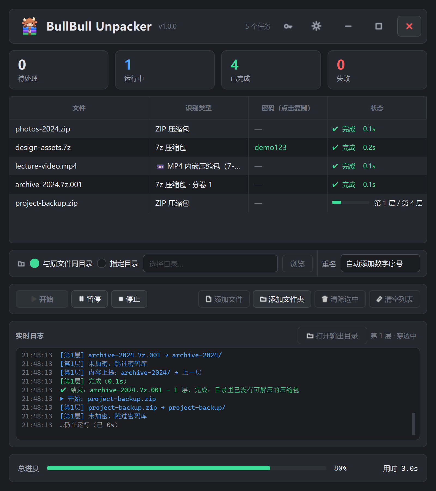
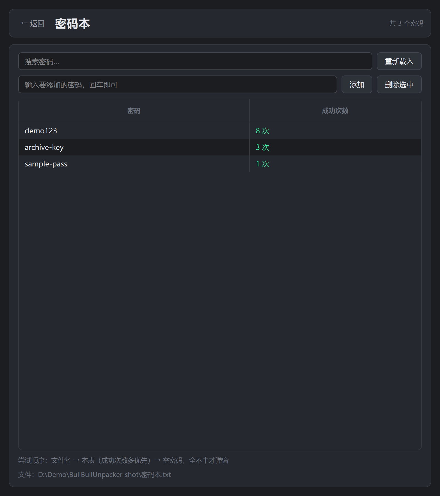
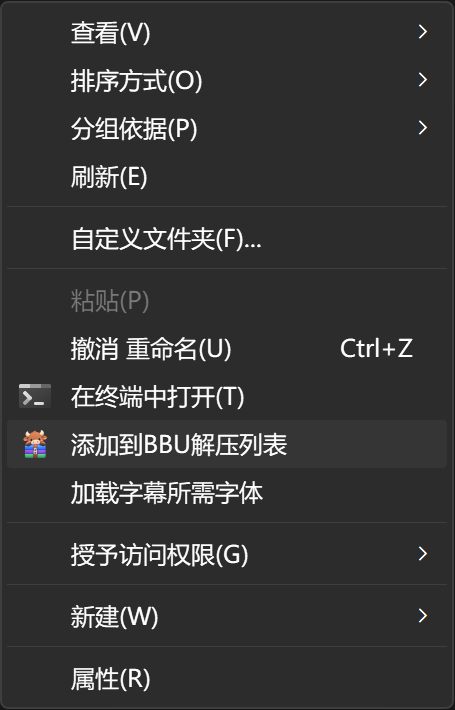

<div align="center">
  

  # BullBull Unpacker

  BullBull Unpacker (牛牛解压器) is a nested-archive extraction tool for Windows

  [](https://github.com/Shiina-Tak1/BullBull-Unpacker/releases)
  [](LICENSE)
</div>

**English** | [简体中文](README.md)

## Features

- Supports zip / 7z / rar / tar / lz4 / lz5 and more (encrypted RAR needs a separate WinRAR installation)
- Detects archives disguised as mp4 and other media formats, and extracts them
- Extracts nested archives, removes intermediate files and leftover empty folders
- Remembers extraction passwords, and lets you add or edit them by hand
- Explorer context menu integration — add a file to the extraction list in one click
- Portable, no installation required: unzip it anywhere and run

## Screenshots

<div align="center">
  
  
  
</div>

## Password memory

Passwords are tried in a fixed order, stopping at the first hit:

1. **Password carried in the file name** — extracted from names such as `xxx_密码pwd.zip`
2. **Password book** — tried in descending order of success count
3. **Empty password** — some archives are unencrypted or use an empty password
4. **Prompt** — if none of the above match, the user is asked to type it

A password is written to the book only **after an extraction actually succeeds**, so nothing is
recorded by mistake. Unencrypted archives are detected up front and skip the whole password
book, which avoids false hit records. The book is a plain text file in
`password<TAB>successes` format (the field name inside the file is Chinese), one entry per
line, editable by hand.

## Privacy

- The application runs entirely locally. It contains no network component and neither uploads
  nor collects anything.
- The password book is stored as **plain text** with no encryption. Keep it safe.

See [`docs/PRIVACY.md`](docs/PRIVACY.md) for the full privacy policy.

## Third-party components

This project uses or references the following third-party components:

- **7-Zip ZS** — bundled extraction engine, under the GNU LGPL. Full license and file list in
  [`tools/7z/License.txt`](tools/7z/License.txt)
- **PySide6 / Qt6** — UI framework, under the GNU LGPLv3
- **WinRAR** — used to extract encrypted RAR / RAR5 archives. The user must install it
  separately and hold a valid license; this project neither bundles, distributes nor modifies
  any of its components

See [`THIRD-PARTY.md`](docs/THIRD-PARTY.md) for details.

## Running and building from source

Requires **Windows + Python 3.14**.

```powershell
git clone https://github.com/Shiina-Tak1/BullBull-Unpacker.git
cd BullBull-Unpacker
python -m venv .venv
.venv\Scripts\python -m pip install -r docs\REQUIREMENTS.txt
.venv\Scripts\python run.py
```

Building the Windows portable package:

```powershell
.venv\Scripts\python -m pip install -r docs\REQUIREMENTS-BUILD.txt
powershell -NoProfile -ExecutionPolicy Bypass -File build\build_portable.ps1
```

## AI-generated content

Most of this project's design, code, documentation and test cases were generated by DeepSeek.
The application icon was generated by OpenAI GPT-Image.

## License

This project is licensed under [GNU GPLv3](https://choosealicense.com/licenses/gpl-3.0/).
